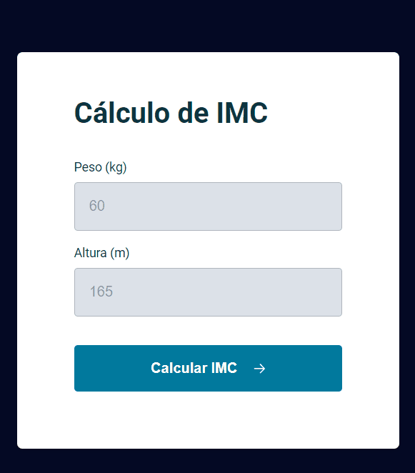

<h1 align="center">Calculadora IMC </h1>

 
 

  

 
    <a href="https://fernandoaugustodev.github.io/calculadoraIMC/" target="_blank" >Veja o Projeto</a>

## 💻 Sobre o Projeto
 

 Para calcular o IMC (Índice de Massa Corporal), basta preencher os campos. Saiba se você está bem de saúde ✅

- Criação de eventos;
- Funçao Callback;
- Criação de funções;
- Operadores comparativos;
- Import/Export; 
- Clean Code;

 

## 🛠 Techs

Tecnologias usadas neste projeto

✅ HTML  
✅ CSS  
✅ JS   

## 👨🏼‍💻 Autor

Fernando Augusto 

 
  
 
© 2022 GitHub, Inc.
Terms Privacy Security Status Docs
